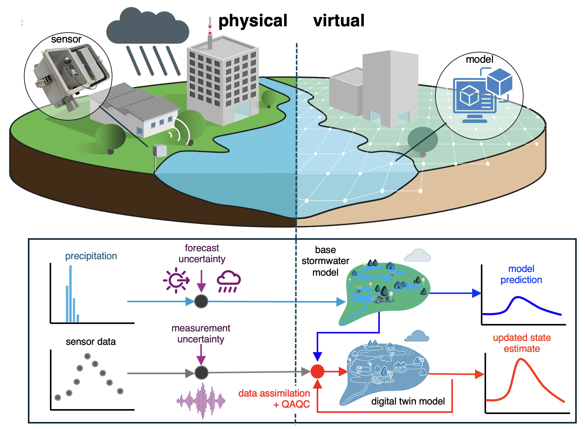

# Digital twin of an urban watershed -- Waller Creek Watershed 

Source code and data from the digital twin of an urban watershed (Waller Creek Watershed) with online sensor data.
- **Reference**: Kim, Y., Oh, J., & Bartos, M. (2025). Stormwater digital twin with online quality control detects urban flood hazards under uncertainty. Sustainable Cities and Society, 118, 105982. https://doi.org/10.1016/j.scs.2024.105982 
- **Online sensor data**: http://ec2-3-91-156-8.compute-1.amazonaws.com:3000/d/jhFO4Gsnk/waller-creek-nodes?orgId=1&from=1677169551578&to=1677621318737 

<!-- Map : http://ec2-13-58-107-29.us-east-2.compute.amazonaws.com:5000  -->
<!--
- Rain forecast: http://ec2-54-161-46-14.compute-1.amazonaws.com:3000/d/c480f733-570f-4e0f-81c2-0c60cd740063/weather-forecast?orgId=1&from=now-7d&to=now
- - Real-time Simulation: http://ec2-54-161-46-14.compute-1.amazonaws.com:3000/d/c33c7912-3864-410f-bfd7-e17a1045d6c6/simulation?orgId=1&from=now-7d&to=now
-->

  

